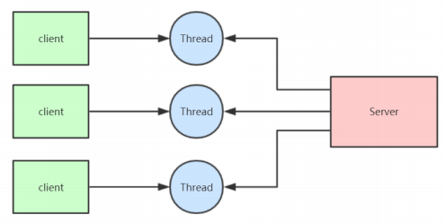
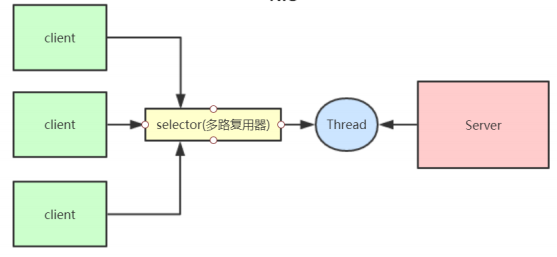
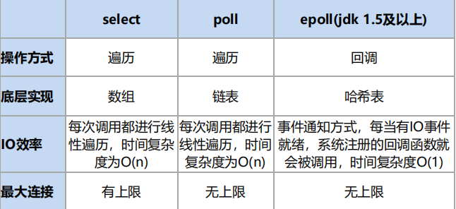
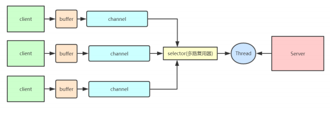
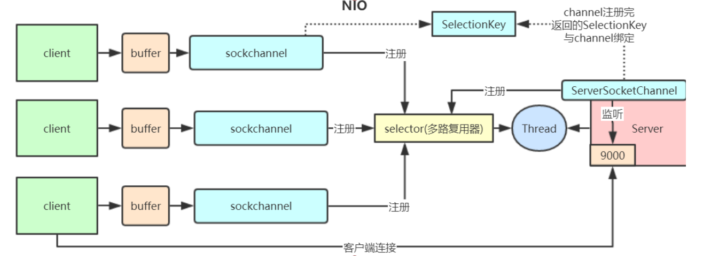
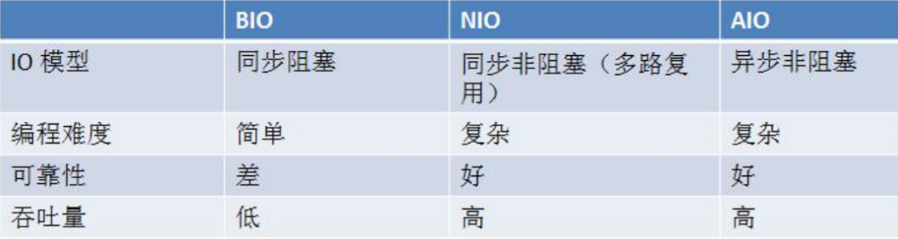
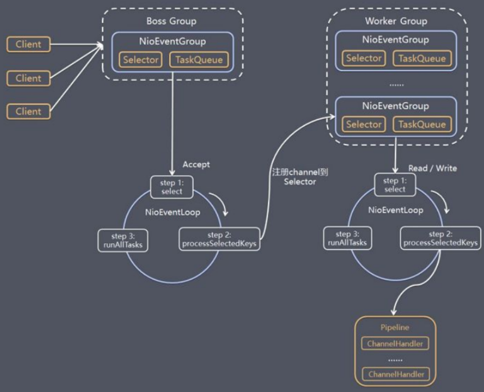
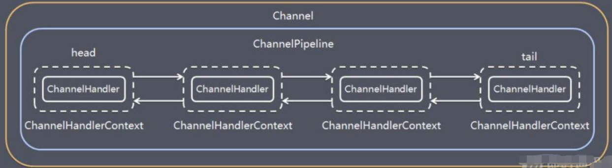
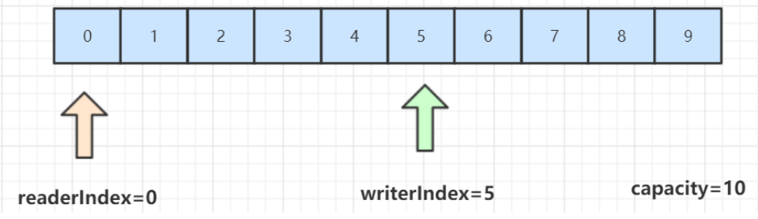

### 一、IO模型分类

IO模型就是说用什么样的通道进行数据的发送和接收，Java共支持3种网络编程IO模式：**BIO，NIO，AIO** 

##### 1. BIO-Blocking IO

同步阻塞模型，一个客户端连接对应一个处理线程



- 缺点

  1、IO代码里read操作是阻塞操作，如果连接不做数据读写操作会导致线程阻塞，浪费资源 

  2、如果线程很多，会导致服务器线程太多，压力太大。

- 应用

  适用于连接数目较小且固定的架构，对服务器要求高，但编码简单

  

##### 2. NIO-Non Blocking IO

同步非阻塞，服务器实现模式为一个线程可以处理多个请求(连接)，客户端发送的连接请求都会注册到**多路复用器selector**上，多路复用器轮询到连接有IO请求就进行处理。 



- I/O多路复用底层实现：Linux API（select，poll，epoll）来实现，区别： 



- 适用

  NIO方式适用于连接数目多且连接比较短（轻操作） 的架构， 比如聊天服务器， 弹幕系统， 服务器间通讯，编程比较复杂， JDK1.4 开始支持

三大核心组件： **Channel(通道)， Buffer(缓冲区)，Selector(选择器)** 



> 1、channel 类似于流，每个 channel 对应一个 buffer缓冲区，buffer 底层就是个数组 
>
> 2、channel 会注册到 selector 上，由 selector 根据 channel 读写事件的发生将其交由某个空闲的线程处理 
>
> 3、selector 可以对应一个或多个线程 
>
> 4、NIO 的 Buffer 和 channel 都是既可以读也可以写 

NIO服务端程序详解：

> ```java
>/*
> 1、创建一个 ServerSocketChannel 和 Selector ，并将 ServerSocketChannel 注册到 Selector 上 
>2、 selector 通过 select() 方法监听 channel 事件，当客户端连接时，selector 监听到连接事件， 获取到 ServerSocketChannel 注册时绑定的 selectionKey 
> 3、selectionKey 通过 channel() 方法可以获取绑定的 ServerSocketChannel 
>4、ServerSocketChannel 通过 accept() 方法得到 SocketChannel 
> 5、将 SocketChannel 注册到 Selector 上，关心 read 事件 
>6、注册后返回一个 SelectionKey, 会和该 SocketChannel 关联 
> 7、selector 继续通过 select() 方法监听事件，当客户端发送数据给服务端，selector 监听到read事件，获取到 SocketChannel 注册时绑定的 selectionKey 
>8、selectionKey 通过 channel() 方法可以获取绑定的 socketChannel 
> 9、将 socketChannel 里的数据读取出来 
>10、用 socketChannel 将服务端数据写回客户端 
> */
>```
> 
>**总结：**NIO模型的selector 就像一个大总管，负责监听各种IO事件，然后转交给后端线程去处理 **NIO相对于BIO非阻塞的体现就在，BIO的后端线程需要阻塞等待客户端写数据(比如read方法)，如果客户端不写数据线程就要阻塞，NIO把等待客户端操作的事情交给了大总管 selector，selector 负责轮询所有已注册的客户端，发现有事件发生了才转交给后端线程处理，后端线程不需要做任何阻塞等待，直接处理客户端事件的数据即可，处理完马上结束，或返回线程池供其他客户端事件继续使用。还有就是 channel 的读写是非阻塞的。**
> 
> **Redis就是典型的NIO线程模型**，selector收集所有连接的事件并且转交给后端线程，线程连续执行所有事件命令并将结果写回客户端



##### 3. AIO 

异步非阻塞， 由操作系统完成后回调通知服务端程序启动线程去处理， 一般适用于连接数较多且连接时间较长的应用 （重操作），JDK7 开始支持 


##### 4. 三种IO的对比



> 老张爱喝茶，废话不说，煮开水。 
>
> 出场人物：老张，水壶两把（普通水壶，简称水壶；会响的水壶，简称响水壶）。 
>
> 1 老张把水壶放到火上，立等水开。**（同步阻塞）** 
>
> 老张觉得自己有点傻 
>
> 2 老张把水壶放到火上，去客厅看电视，时不时去厨房看看水开没有。**（同步非阻塞）** 
>
> 老张还是觉得自己有点傻，于是变高端了，买了把会响笛的那种水壶。水开之后，能大声发出嘀~~~~的噪音。 
>
> 3 老张把响水壶放到火上，立等水开。**（异步阻塞）** 
>
> 老张觉得这样傻等意义不大 
>
> 4 老张把响水壶放到火上，去客厅看电视，水壶响之前不再去看它了，响了再去拿壶。**（异步非阻塞）** 
>
> 老张觉得自己聪明了。 
>
> 所谓同步异步，只是对于水壶而言。 
>
> 普通水壶，同步；响水壶，异步。 
>
> 虽然都能干活，但响水壶可以在自己完工之后，提示老张水开了。这是普通水壶所不能及的。 
>
> 同步只能让调用者去轮询自己（情况2中），造成老张效率的低下。 
>
> 所谓阻塞非阻塞，仅仅对于老张而言。 
>
> 立等的老张，阻塞；看电视的老张，非阻塞。


### 二、Netty

NIO类库和API比较繁杂，使用麻烦。需要熟练掌握selector、serverSocketChannel、SocketChannel、ByteBuffer等。开发工作量和难度都非常大： 例如**客户端面临断连重连、 网络闪断、心跳处理、半包读写、 网络拥塞和异常流的处理**等等。 

#### 1. Netty简介

Netty 对 JDK 自带的 NIO 的 API 进行了良好的封装，解决了上述问题。且Netty拥有高性能、吞吐量更高，延迟更低，减少资源消耗，最小化不必要的内存复制等优点。让你的业务逻辑从网络基础应用编码中分离出来，让你可以专注业务的开发，而不需写一大堆类似NIO的网络处理操作。 

使用场景：

1. 互联网行业：在分布式系统中，各个节点之间需要远程服务调用，高性能的**RPC框架**必不可少， Netty 作为异步高性能的通信框架，往往作为基础通信组件被这些 RPC 框架使用。

   ​	典型的应用有：阿里分布式服务框架 **Dubbo** 的 RPC 框架使用 Dubbo 协议进行节点间通信，Dubbo 协议默认使用Netty作为基础通信组件，用于实现各进程节点之间的内部通信。**Rocketmq**底层也是用的Netty作为基础通信组件。 

2. 游戏行业：无论是手游服务端还是大型的网络游戏，Java 语言得到了越来越广泛的应用。Netty 作为高性能的基础通信组件，它本身提供了 TCP/UDP 和 HTTP 协议栈。 

3. 大数据领域：经典的 **Hadoop** 的高性能通信和序列化组件 **Avro** 的 RPC 框架，默认采用 Netty 进行跨界点通信，它的 Netty Service 基于 Netty 框架二次封装实现。

#### 2. Netty的线程模型

《Scalable IO in Java》中的IO模式中，Netty的线程模型如下所示



模型解释：

1. Netty 抽象出两组线程池BossGroup和WorkerGroup，BossGroup专门负责接收客户端的连接, WorkerGroup专门负责网络的读写

2. BossGroup和WorkerGroup类型都是NioEventLoopGroup 

3. NioEventLoopGroup 相当于一个事件循环**线程组**, 这个组中含有多个事件循环线程 ， 每一个事件循环线程是NioEventLoop 

4. 每个NioEventLoop都有一个selector , 用于监听注册在其上的socketChannel的网络通讯 

5. 每个BossNioEventLoop线程内部循环执行的步骤有 3 步 

   - 处理accept事件 , 与client 建立连接 , 生成NioSocketChannel
   - 将NioSocketChannel注册到某个worker NIOEventLoop上的selector 
   - 处理任务队列的任务 ， 即runAllTasks 

6. 每个worker NIOEventLoop线程循环执行的步骤 

   - 轮询注册到自己selector上的所有NioSocketChannel 的read, write事件

   - 处理 I/O 事件， 即read , write 事件， 在对应NioSocketChannel 处理业务 

   - runAllTasks处理任务队列TaskQueue的任务 ，一些耗时的业务处理一般可以放入 

     TaskQueue中慢慢处理，这样不影响数据在 pipeline 中的流动处理

7. 每个worker NIOEventLoop处理NioSocketChannel业务时，会使用 pipeline (管道)，管道中维护了很多 handler 处理器用来处理 channel 中的数据

**Netty模块组件：**

> **Bootstrap、ServerBootstrap：**
>
> 引导，一个 Netty 应用通常由一个 Bootstrap 开始，主要作用是配置整个 Netty 程序，串联各个组件，Netty 中 Bootstrap 类是客户端程序的启动引导类，ServerBootstrap是服务端启动引导类
>
> **Future、ChannelFuture：**
>
> Netty中所有的 IO 操作都是异步的，不能立刻得知消息是否被正确处理。但是可以过一会等它执行完成或者直接注册一个监听， Future 和 ChannelFutures可以注册一个监听，当操作执行成功或失败时监听会自动触发注册的监听事件
>
> **Channel：**
>
> 能够执行I/O操作
>
> ```
> 1.当前网络连接的通道的状态（例如是否打开？是否已连接？）
> 2.网络连接的配置参数 （例如接收缓冲区大小） 
> 3.提供异步的网络 I/O 操作(如建立连接，读写，绑定端口)，异步调用意味着任何 I/O 调用都将立即返回，并且不保证在调用结束时所请求的 I/O 操作已完成。 
> 4.调用立即返回一个 ChannelFuture 实例，通过注册监听器到 ChannelFuture 上，可以 I/O 操作成 功、失败或取消时回调通知调用方。 
> 5.支持关联 I/O 操作与对应的处理程序。 不同协议、不同的阻塞类型的连接都有不同的 Channel 类型与之对应。
> 
> 常用的channel：
> NioSocketChannel，异步的客户端TCP Socket连接。 
> NioServerSocketChannel，异步的服务器端TCP Socket连接。 
> NioDatagramChannel，异步的UDP连接。 
> NioSctpChannel，异步的客户端Sctp连接。 
> NioSctpServerChannel，异步的Sctp服务器端连接，这些通道涵盖了UDP和TCP网络IO以及文件IO。
> ```
>
> **Selector：**
>
> Netty基于Selector对象实现IO多路复用，通过Selector一个线程可以监听多个链接的Channel事件。
>
> 当向一个Selector中注册一个channel后，selector内部会自动不断select这些channel是否有IO已就绪的IO事件，这样程序就可以简单的用一个线程管理多个channel。
>
> **NIOEventLoop：**
>
> NIOEventLoop维护了一个线程和任务队列，支持异步提交执行任务，线程启动时会调用其中的run方法，执行IO以及非IO任务：
>
> - IO任务：selectionKey中ready的事件，如accept、connect、read、write等，由processSelectedKeys 方法触发
> - 非IO任务：添加到 taskQueue 中的任务，如 register0、bind0等任务，由runAllTasks方法触发
>
> **NIOEventLoopGroup：**
>
> 管理eventLoop的生命周期，可以理解为一个线程池，内部维护了一组线程，每个线程(NioEventLoop)负责处理多个 Channel 上的事件，而一个 Channel 只对应于一个线程
>
> **ChannelHandler：**
>
> 接口，充当了处理入站和出站数据的应用程序逻辑容器，处理IO事件或拦截IO事件，并将其转发到其ChannelPipeline（业务处理链）中的下一个ChannelHandler处理程序
>
> 使用时一般使用其子类或适配器类
>
> ```
> ChannelInboundHandler 用于处理入站 I/O 事件。 
> ChannelOutboundHandler 用于处理出站 I/O 操作。
> ChannelInboundHandlerAdapter 用于处理入站 I/O 事件。 
> ChannelOutboundHandlerAdapter 用于处理出站 I/O 操作。
> ```
>
> **ChannelHandlerContext**
>
> 保存 Channel 相关的所有上下文信息，同时关联一个 ChannelHandler 对象
>
> **ChannelPipline**
>
> 保存ChannelHandler的List，用于处理或拦截Channel的入站和出站事件。
>
> ChannelPipeline实现了一种高级形式的拦截过滤器模式，使用户可以完全控制事件的处理方式，以及Channel 中各个的 ChannelHandler 如何相互交互。
>
> Netty 中每个 Channel 都有且仅有一个 ChannelPipeline 与之对应，它们的组成关系如下：
>
> 
>
> 一个 Channel 包含了一个 ChannelPipeline，而ChannelPipeline中又维护了一个由ChannelHandlerContext 组成的双向链表，并且每个 ChannelHandlerContext 中又关联着一个ChannelHandler。
>
> read事件(入站事件)和write事件(出站事件)在一个双向链表中，入站事件会从链表 head 往后传递到最后一个入站的 handler，出站事件会从链表 tail 往前传递到最前一个出站的handler，两种类型的handler互不干扰。 

#### 3. ByteBuf

ByteBuf 由一串字节数组构成，数组中每个字节用来存放信息。 

ByteBuf 提供了两个索引，一个用于读取数据，一个用于写入数据。这两个索引通过在字节数组中移动，来定位需要读或者写信息的位置。 



如果 readerIndex 超过了 writerIndex 的时候，Netty 会抛出 IndexOutOf-BoundsException异常


#### 4. Netty编码解码

Netty中涉及编解码的组件有Channel、ChannelHandler、ChannelPipe等

**编码解码器：**

> 当通过Netty发送或者接受一个消息的时候，就将会发生一次数据转换。入站消息会被**解码**：从字节转换为另一种格式（比如java对象）。出站消息，它会被**编码成字节**。
>
> Netty提供了一系列实用的编码解码器，他们都实现了ChannelInboundHandler或者ChannelOutcoundHandler接口。这些类中，channelRead方法已经被重写。
>
> 以入站为例，对于每个从入站Channel读取的消息，这个方法会被调用。随后，它将调用由已知解码器所提供的decode()方法进行解码，并将已经解码的字节转发给ChannelPipeline中的下一个ChannelInboundHandler。 
>
> Netty提供了很多编解码器，比如编解码字符串的StringEncoder和StringDecoder，编解码对象的ObjectEncoder和ObjectDecoder等。也可以通过集成ByteToMessageDecoder**自定义编解码器**。


